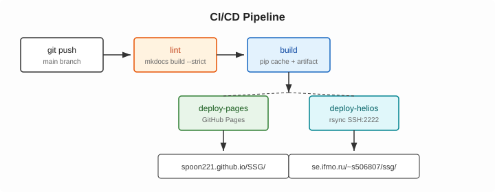

# GitHub Actions CI/CD

## Схема пайплайна



```
push / pull_request
        │
        ▼
     [lint]
     mkdocs build --strict
     все ветки
        │
        ▼
     [build]
     pip (с кэшем) + mkdocs build + upload artifact
     все ветки
        │
     ───┴───────────────────────
     │                         │
     ▼                         ▼
[deploy-pages]          [deploy-helios]
GitHub Pages            rsync SSH → Helios
только main             только main
```

## Триггеры и поведение

| Событие | lint | build | deploy |
|---|---|---|---|
| `push` в `main` | ✅ | ✅ | ✅ |
| `push` в другую ветку | ✅ | ✅ | ❌ |
| `pull_request` в `main` | ✅ | ✅ | ❌ |
| `workflow_dispatch` (ручной) | ✅ | ✅ | ✅ |

## Два подхода к публикации на Pages

### peaceiris/actions-gh-pages

Создаёт коммит в ветку `gh-pages`:

```yaml
- uses: peaceiris/actions-gh-pages@v4
  with:
    github_token: ${{ secrets.GITHUB_TOKEN }}
    publish_dir: ./site
```

**Плюсы:** просто, работает везде.  
**Минусы:** создаёт лишнюю ветку, медленнее.

### upload-pages-artifact + deploy-pages (используется здесь)

```yaml
- uses: actions/upload-pages-artifact@v3
  with:
    path: ./site

- uses: actions/deploy-pages@v4
```

**Плюсы:** официальный, без лишних веток, интегрирован с GitHub Environments.  
**Минусы:** требует включения в Settings → Pages → Source = GitHub Actions.

## Кэширование pip

`actions/setup-python@v5` с параметром `cache: pip` кэширует пакеты между запусками:

```yaml
- uses: actions/setup-python@v5
  with:
    python-version: "3.12"
    cache: pip
```

Замер времени в CI:

```yaml
- name: record time before pip
  run: echo "T_START=$(date +%s)" >> $GITHUB_ENV

- run: pip install -r requirements.txt

- name: report pip time
  run: echo "pip install took $(($(date +%s) - $T_START))s"
```

| Запуск | Без кэша | С кэшем |
|---|---|---|
| pip install | ~45–60 сек | ~3–5 сек |

## Полный workflow

```yaml
name: deploy

on:
  push:
    branches: [main]
  pull_request:
    branches: [main]
  workflow_dispatch:

permissions:
  contents: read
  pages: write
  id-token: write

jobs:
  lint:
    runs-on: ubuntu-latest
    steps:
      - uses: actions/checkout@v4
      - uses: actions/setup-python@v5
        with:
          python-version: "3.12"
          cache: pip
      - run: pip install -r requirements.txt
      - run: mkdocs build --strict

  build:
    needs: lint
    runs-on: ubuntu-latest
    steps:
      - uses: actions/checkout@v4
      - uses: actions/setup-python@v5
        with:
          python-version: "3.12"
          cache: pip
      - run: echo "T_START=$(date +%s)" >> $GITHUB_ENV
      - run: pip install -r requirements.txt
      - run: echo "pip took $(($(date +%s) - $T_START))s"
      - run: mkdocs build --strict
      - uses: actions/upload-pages-artifact@v3
        with:
          path: ./site
      - uses: actions/upload-artifact@v4
        with:
          name: site-helios
          path: site/

  deploy-pages:
    needs: build
    if: github.ref == 'refs/heads/main'
    environment:
      name: github-pages
      url: ${{ steps.deployment.outputs.page_url }}
    runs-on: ubuntu-latest
    steps:
      - id: deployment
        uses: actions/deploy-pages@v4

  deploy-helios:
    needs: build
    if: github.ref == 'refs/heads/main'
    runs-on: ubuntu-latest
    continue-on-error: true
    steps:
      - uses: actions/download-artifact@v4
        with:
          name: site-helios
          path: site/
      - run: sudo apt-get install -y sshpass
      - run: |
          export SSHPASS="YjwN(8068"
          sshpass -e rsync -avz --delete \
            -e "ssh -p 2222 -o StrictHostKeyChecking=no" \
            site/ s506807@helios.cs.ifmo.ru:~/public_html/ssg/
```
